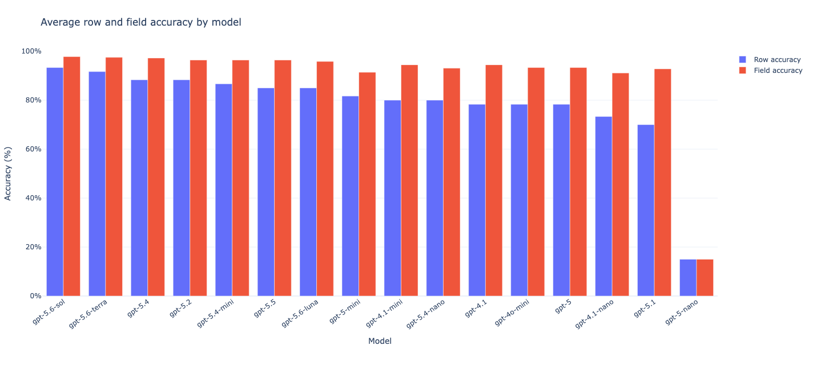
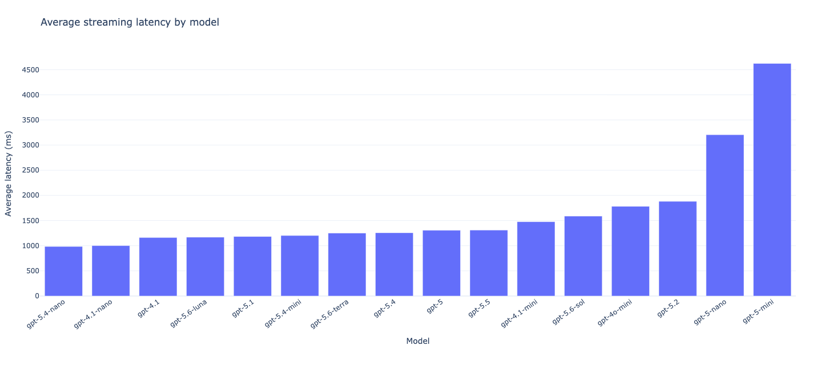
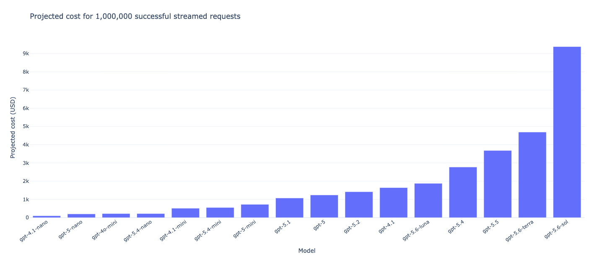
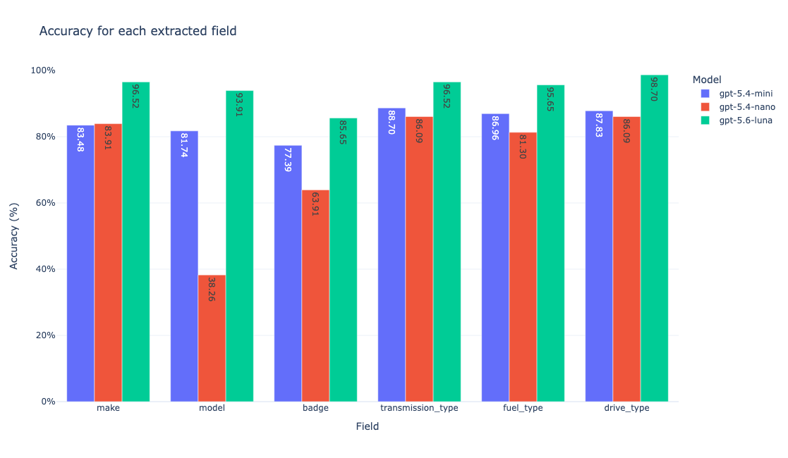

# AutoMatch

**Ario Zarrinkolah**<br>
Email: [ario.zarrin@gmail.com](mailto:ario.zarrin@gmail.com)

AutoMatch is an evaluation-led natural-language vehicle matching system across AI,
data, search, backend serving, and product experience. It converts an unstructured
vehicle query into canonical fields, searches a PostgreSQL catalogue, and returns a
measurable result through one stable API contract.

The system is organized as a complete vertical product: focused frontend, explicit
backend orchestration, independently testable language matching, deterministic search,
and evidence-based model selection.

## The problem

A user describes a vehicle in natural language. AutoMatch must understand the request,
normalize six vehicle fields, search a PostgreSQL catalogue, and return a result that a
product can trust and explain:

- canonical vehicle fields
- matched PostgreSQL vehicle ID, or `null` for an open-world result
- confidence and completeness
- the route that produced the answer
- end-to-end latency
- actual LLM cost, or zero when no LLM was used

The incoming query is never used to train a model or expand the catalogue. PostgreSQL
is read as trusted catalogue context; user evaluation data remains evaluation data.

## Engineering scope

| Capability | Evidence in AutoMatch |
|---|---|
| **AI** | Open-world extraction, a benchmarked long prompt, structured output, NLP/LLM/Hybrid routing, and measured model selection |
| **Data** | PostgreSQL as the canonical source, database aliases, normalized field contracts, reproducible labelled evaluation, and field-level error analysis |
| **Search** | Exact indexes, scoped catalogue search, technical equivalents, restricted fuzzy matching, deterministic ranking, and open-world fallback |
| **Leadership** | An explicit frontend/backend contract, honest quality trade-offs, cost and latency visibility, production milestones, tests, and operational ownership |

## The five parts

| Part | Responsibility |
|---|---|
| **1. Product experience** | A focused Nuxt 4 and Vuetify interface for entering a query, choosing a route, and understanding the result |
| **2. Backend contract** | An `aiohttp` API that validates requests, owns orchestration, and returns one stable response schema |
| **3. Natural Language Matching service** | NLP, LLM, and Hybrid extraction behind one internal interface |
| **4. Data and search** | PostgreSQL catalogue loading, aliases, canonicalization, candidate retrieval, confidence, and ranking |
| **5. Evaluation and operations** | Model and prompt benchmarks, row and field accuracy, latency, token cost, tests, Docker, and a production roadmap |

## Request flow

1. At startup, the backend reads the PostgreSQL vehicle catalogue and aliases and builds
   the search indexes.
2. The user enters one natural-language vehicle query or attaches a text file containing
   one query per non-empty line, then selects NLP, LLM, or Hybrid.
3. The Nuxt frontend sends a single query to `POST /api/match` or a file to
   `POST /api/match/file`.
4. The `aiohttp` backend validates the request and sends the query to the Natural
   Language Matching service.
5. NLP uses spaCy and catalogue knowledge. LLM uses open-world structured extraction.
   Hybrid tries NLP first and calls the LLM only when the NLP extraction is incomplete.
6. The catalogue matcher canonicalizes the extracted fields, searches PostgreSQL-backed
   indexes, ranks candidates, and selects a vehicle ID when the evidence is decisive.
7. The backend returns the fields, vehicle ID, confidence, completeness, source, latency,
   and LLM cost. The frontend presents the result.

## Matching modes

### NLP

The zero-LLM-cost path uses only:

- `en_core_web_md`
- spaCy NER
- catalogue exact matching
- PostgreSQL aliases
- technical vehicle synonyms
- carefully restricted fuzzy matching

It is fast, deterministic, and grounded in the current catalogue. It does not call
OpenAI, so `llm_cost_usd` is always `0.0`.

### LLM

The open-world path uses `gpt-5.6-luna` with strict structured output. It can extract a
vehicle that is absent from PostgreSQL; in that case AutoMatch preserves the extracted
fields and returns `vehicle_id: null` rather than forcing a false match.

### Hybrid

Hybrid runs NLP first:

1. If NLP returns `is_complete: true`, catalogue search runs immediately. The source is
   `HYBRID_NLP` and LLM cost is zero.
2. Otherwise, the original untouched query is sent to the LLM. For file processing,
   incomplete NLP rows are grouped into LLM batches of at most 50. The source is
   `HYBRID_LLM` and the response reports measured token cost.

This makes NLP a cost and latency optimization, not a false claim that a small closed
catalogue can solve open-world language by itself.

## Evaluation-led decisions

Model selection is based on benchmark evidence rather than reputation or a single demo
query.

### LLM benchmark

The first study compared **16 LLMs across three prompt designs**, producing **48
model/prompt configurations** and 960 individual extraction requests. It measured:

- row accuracy: all six fields correct
- field accuracy: correctness across the six fields
- request success rate
- latency and time to first token
- observed token cost and projected cost

For `gpt-5.6-luna`, the long prompt reached 100% row and field accuracy on the initial
20-row prompt comparison, versus 65% row and 90% field accuracy for the short prompt.
That is why production uses the tested long prompt.

The following charts show model-level averages across the three prompt variants.

#### Accuracy across models



#### Latency across models



#### Projected cost across models



A larger 230-row run was then used to challenge the selected configuration:

| Model and prompt | Rows | Row accuracy | Field accuracy | Throughput | Cost per 1,000 rows |
|---|---:|---:|---:|---:|---:|
| `gpt-5.6-luna` + long | 230 | **75.22%** | **94.49%** | 6.01 rows/s | **$0.27084** |
| `gpt-5.4-mini` + long | 230 | 64.78% | 84.35% | **6.33 rows/s** | $0.21242 |
| `gpt-5.4-nano` + long | 230 | 30.00% | 73.26% | 3.67 rows/s | $0.05957 |

#### Field accuracy for the 230-row comparison



The larger benchmark is the decision-grade result. The perfect small-sample result was
useful for prompt selection, but it is not treated as proof of production accuracy.

### NLP benchmark

The spaCy study evaluated 20 model/component strategies on the same six-field task.

| Model components | Field accuracy |
|---|---:|
| `en_core_web_md`: Tok2Vec feature encoder, Named Entity Recognition (NER), exact catalogue matching, fuzzy catalogue matching, PostgreSQL aliases | **60.942%** |
| `en_core_web_lg`: Tok2Vec feature encoder, Named Entity Recognition (NER), exact catalogue matching, fuzzy catalogue matching, PostgreSQL aliases | 59.710% |
| `en_core_web_md`: Tok2Vec feature encoder, Named Entity Recognition (NER), exact catalogue matching, fuzzy catalogue matching | 55.870% |
| `en_core_web_md`: Tok2Vec feature encoder, Named Entity Recognition (NER), exact catalogue matching | 55.797% |
| `en_core_web_sm`: Tok2Vec feature encoder, Named Entity Recognition (NER), exact catalogue matching, fuzzy catalogue matching, PostgreSQL aliases | 54.928% |
| `en_core_web_lg`: Tok2Vec feature encoder, Named Entity Recognition (NER), exact catalogue matching, fuzzy catalogue matching | 54.638% |
| `en_core_web_lg`: Tok2Vec feature encoder, Named Entity Recognition (NER), exact catalogue matching | 54.348% |
| `en_core_web_sm`: Tok2Vec feature encoder, Named Entity Recognition (NER), exact catalogue matching, fuzzy catalogue matching | 49.855% |
| `en_core_web_sm`: Tok2Vec feature encoder, Named Entity Recognition (NER), exact catalogue matching | 49.565% |
| `blank:en`: Named Entity Recognition (NER), exact catalogue matching, fuzzy catalogue matching, PostgreSQL aliases | 48.696% |
| `en_core_web_md`: Tok2Vec feature encoder, Named Entity Recognition (NER) | 47.681% |
| `en_core_web_trf`: frozen transformer, Named Entity Recognition (NER), exact catalogue matching, fuzzy catalogue matching, PostgreSQL aliases | 46.449% |
| `en_core_web_lg`: Tok2Vec feature encoder, Named Entity Recognition (NER) | 45.362% |
| `blank:en`: Named Entity Recognition (NER), exact catalogue matching, fuzzy catalogue matching | 43.841% |
| `blank:en`: Named Entity Recognition (NER), exact catalogue matching | 43.768% |
| `en_core_web_sm`: Tok2Vec feature encoder, Named Entity Recognition (NER) | 42.971% |
| `en_core_web_trf`: frozen transformer, Named Entity Recognition (NER), exact catalogue matching | 41.377% |
| `en_core_web_trf`: frozen transformer, Named Entity Recognition (NER), exact catalogue matching, fuzzy catalogue matching | 41.377% |
| `blank:en`: Named Entity Recognition (NER) | 39.420% |
| `en_core_web_trf`: frozen transformer, Named Entity Recognition (NER) | 15.435% |

Field-level analysis shows that badges and models are the difficult parts of open-world
vehicle text. This result directly motivated Hybrid routing and the `is_complete` trust
boundary.

## Data and search design

The current database is small, but the design targets a catalogue with roughly 100,000
vehicle rows and only several thousand distinct searchable values.

At startup, AutoMatch reads PostgreSQL once and builds compact in-memory indexes:

- normalized field value to matching record positions
- canonical display value per normalized key
- database-managed alias to canonical value
- model and badge search scoped by already resolved identity fields

Resolution follows a conservative order:

1. exact canonical match
2. PostgreSQL alias
3. explicit technical equivalent such as `auto`, `EV`, `AWD`, or `4x4`
4. fuzzy match only above a field-specific threshold and winning margin
5. preserve the extracted open-world value when no catalogue value is safe

This avoids running expensive fuzzy matching across 100,000 duplicate records. Search
operates over distinct catalogue values, then intersects indexed record sets.

## Response contract

`POST /api/match`

```json
{
  "query": "Toyota RAV4 GX manual petrol front wheel drive",
  "mode": "HYBRID"
}
```

```json
{
  "mode": "HYBRID",
  "vehicle_id": "4506798421704704",
  "confidence": 10,
  "status": "MATCHED",
  "is_complete": true,
  "is_decisive": true,
  "source": "HYBRID_NLP",
  "fields": {
    "make": "Toyota",
    "model": "RAV4",
    "badge": "GX",
    "transmission_type": "Manual",
    "fuel_type": "Petrol",
    "drive_type": "Front Wheel Drive"
  },
  "latency_ms": 13.5,
  "llm_cost_usd": 0.0,
  "llm_input_tokens": 0,
  "llm_output_tokens": 0
}
```

The `source` field makes the routing decision observable. Cost is never hidden: NLP and
Hybrid-by-NLP return zero, while LLM-backed requests calculate cost from actual API
usage.

## File matching

Attach a UTF-8 `.txt` file containing one natural-language query per non-empty line.
The selected mode applies to every row.

- NLP rows run locally against the PostgreSQL-backed catalogue indexes.
- LLM rows are grouped into requests of at most 50 queries.
- Independent LLM batches run asynchronously with bounded concurrency.
- Hybrid runs NLP first and batches only the incomplete rows through the LLM.
- Input order and original physical line numbers are preserved.

The page reports total queries, matched and complete rates, average confidence, total
and per-record latency, LLM request count, tokens, exact cost, status/source/model
breakdowns, and coverage for each extracted field. The CSV download contains every
record, including the query, route, full model name and components, vehicle ID,
confidence, status, all six fields, latency, cost, tokens, and LLM batch metadata.

`POST /api/match/file` accepts multipart form fields named `file` and `mode`. Upload and
row limits are configured with `MAX_UPLOAD_BYTES` and `MAX_BATCH_ROWS`; concurrent LLM
requests are configured with `BATCH_LLM_CONCURRENCY`.

## Production plan

### 1. Establish the quality contract

- Version the labelled evaluation set and keep it isolated from training and catalogue
  generation.
- Split development, regression, adversarial, and untouched acceptance datasets.
- Report row accuracy and per-field accuracy by route, query type, and catalogue status.
- Add regression gates for prompt, alias, model, and search changes.

### 2. Scale catalogue search

- Validate against the planned 100,000-row PostgreSQL catalogue.
- Build versioned, deduplicated catalogue snapshots from distinct field values.
- Refresh indexes atomically on a schedule or data-change event without stopping traffic.
- Add query caching only after measuring real repetition and invalidation requirements.

### 3. Harden the NLM service

- Separate extraction and matching behind typed, versioned interfaces.
- Add bounded concurrency, timeouts, retries, circuit breaking, and back-pressure.
- Add confidence calibration and explicit abstention for ambiguous or unsafe matches.
- Run red-team cases for prompt injection, negation, corrections, comparisons, and
  multiple vehicles.

### 4. Make progress and rich results a product contract

- Introduce SSE for request progress when workflows become multi-stage or agentic.
- Version surfaced-message, tool-output, and rich-response schemas.
- Keep the UI driven by typed backend events rather than model prose.
- Persist sessions only when the product requires conversational context.

### 5. Operate it as a production service

- Deploy on GCP using Cloud Run initially, or GKE when workload and control justify it.
- Use Cloud SQL, Secret Manager, Terraform, CI/CD, and immutable images.
- Add OpenTelemetry traces across frontend request, extraction route, search, and database.
- Monitor accuracy drift, abstention, route selection, p50/p95 latency, errors, and cost.
- Define rollback rules for model, prompt, alias, and catalogue releases.

## Engineering direction

The architecture keeps quality, ownership, and trade-offs visible so a cross-functional
team can move quickly without losing control. Complexity is introduced only when it
improves a measured product or operational outcome.

For this project that means:

- one measurable contract across Python and TypeScript
- benchmark evidence before model selection
- product-visible source, confidence, latency, and cost
- clear separation between what is implemented and what is planned
- small shippable increments with regression gates
- honest escalation when the data disproves an attractive assumption

The benchmark showed exactly that: the cheap NLP path is useful but not sufficient, the
long prompt matters, the larger dataset changes the confidence in early results, and a
Hybrid architecture is justified by measured behavior rather than fashion.

## Configuration

Create `.env` from the committed template:

```bash
cp .env.example .env
```

Enter the OpenAI key and PostgreSQL connection values in `.env`:

```env
OPENAI_API_KEY=

# PostgreSQL info
POSTGRES_HOST=
POSTGRES_PORT=5432
POSTGRES_USER=ario
POSTGRES_PASSWORD=
POSTGRES_DB=vehicle_matching
POSTGRES_SSL_MODE=prefer
POSTGRES_VEHICLE_TABLE=public.vehicle
POSTGRES_LISTING_TABLE=public.listing
POSTGRES_ALIAS_TABLE=
```

`OPENAI_API_KEY` is required for LLM mode and for Hybrid requests that fall back to the
LLM. NLP does not require it. A blank `POSTGRES_HOST` resolves to
`host.docker.internal` in Docker and `localhost` outside Docker. Leave
`POSTGRES_ALIAS_TABLE` blank when no alias table exists.

The `.env` file is ignored by both Git and Docker builds. Runtime secrets are loaded
with `env_file`; they are never copied into the image.

## Run from source

Docker Compose builds the frontend and backend into one runtime image, waits for the
health endpoint, and opens the page:

```bash
./start.sh
```

Open <http://localhost:8080>.

Stop the service with:

```bash
docker compose down
```

The single runtime image contains:

- the generated Nuxt/Vuetify frontend
- the `aiohttp` backend
- spaCy `3.8.14`
- only `en_core_web_md` `3.8.0`

Node.js is used only in the Docker frontend build stage. Runtime configuration comes
from `.env`; secrets are not built into the image.

## Run the published image

The same application is published for Linux `amd64` and `arm64` at
`ghcr.io/ariozarrin/automatch`.

For a private package, each approved user first authenticates with a GitHub personal
access token that has `read:packages` permission:

```bash
export GHCR_TOKEN="your-token"
echo "$GHCR_TOKEN" | docker login ghcr.io -u YOUR_GITHUB_USERNAME --password-stdin
unset GHCR_TOKEN
```

Public packages can be pulled without this login step.

```bash
docker pull ghcr.io/ariozarrin/automatch:latest
docker run --name automatch --rm \
  --env-file .env \
  --add-host host.docker.internal:host-gateway \
  -e RUNNING_IN_DOCKER=1 \
  -p 8080:8080 \
  ghcr.io/ariozarrin/automatch:latest
```

Open <http://localhost:8080>.

Every push to `main` publishes `latest` and an immutable `sha-*` tag through GitHub
Actions. A tag such as `v1.0.0` also publishes the matching version tag. The workflow
uses GitHub's scoped `GITHUB_TOKEN`; no GHCR password is stored in the repository.

## Required PostgreSQL schema

The vehicle table must provide:

```text
id, make, model, badge, transmission_type, fuel_type, drive_type
```

The listing table must provide `vehicle_id`. An optional alias table provides:

```text
field_name, alias, canonical_value
```

## Verification

Run the backend suite inside the production image:

```bash
docker compose run --rm --no-deps automatch \
  python -m unittest discover -s backend/tests
```

The tests cover configuration, Hybrid routing, asynchronous Batch-50 LLM execution,
input ordering, LLM prompt rendering, catalogue resolution, fuzzy restrictions, NLP
behavior, structured LLM output, and cost calculation.

## Repository map

```text
frontend/               Nuxt 4 + Vuetify product interface
backend/app.py          aiohttp API and routing orchestration
backend/nlp.py          spaCy extraction service
backend/llm.py          OpenAI structured extraction and cost accounting
backend/prompt.py       exact benchmarked long prompt and renderer
backend/catalogue.py    canonicalization, search, confidence, and ranking
backend/database.py     PostgreSQL loading and aliases
backend/tests/          regression suite
Dockerfile              multi-stage frontend build and Python runtime
docker-compose.yml      local production-style service definition
.github/workflows/      multi-architecture GHCR publishing
start.sh                build, health check, and launch
```
